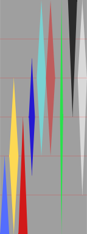

> ⚠️ Requires `Create` mod to work! For a Vanilla-compatible version, make sure to download the correct files!

# Mining Dimension
Sick of strip-mining the Overworld for a handful of diamonds? Mining Dimension gives you a brand-new realm overflowing with resources. Every vanilla ore spawns at significantly higher rates, and—thanks to full Create integration—you’ll also uncover Zinc. Spend less time branch-mining and more time building contraptions!

## Key Features
- Super-rich generation: All vanilla ores spawn ~2-4 × more frequently than in the Overworld
- Create-ready: Includes generation layers for Zinc 
- Balanced height map: Diamond & Gold sit deep, while coal and copper are abundant near the ceiling.

## Ore Distribution



```Diamond - Gold - Redstone - Lapis Lazuli - Zinc - Copper - Emerald - Coal - Iron```

> The stripes' thickness is not to scale!

## Access
You can enter the Dimension with the command /execute in mining_dimension:mining_dimension run tp @s 0 128 0.
But be careful. This Datapack is made for Modpack Developer. Modpack Developers should develop a way to access it!

## Installation
1. Download the latest release
2. Place the .zip in\<world\>/datapacks/
3. Run /reload or restart the world

## Bugs
You can report bugs here by opening an issue.
